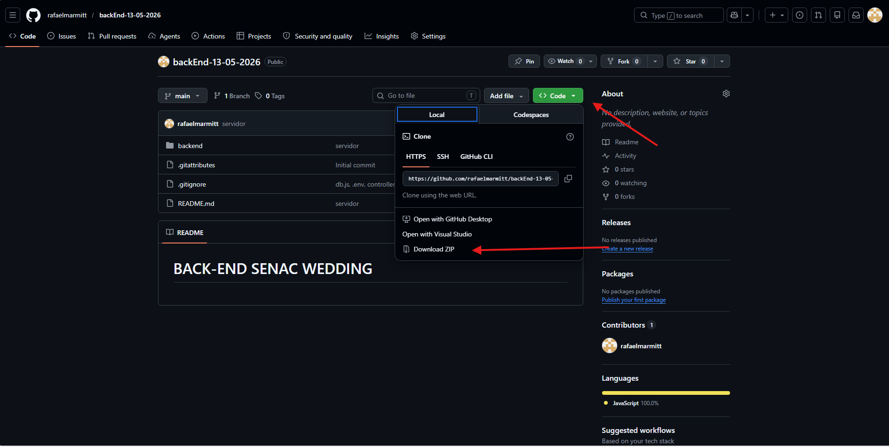

# BACK-END SENAC WEDDING

### Projeto Desenvolvido:

#### Estrutura das pastas:


#### Banco de Dados


#### Funções:

##### backned/controllers/authController.js:


``` js
// Função de login
exports.login = async (req, res) => {
    const { email, senha } = req.body;

    if (!email, !senha) {
        return res.status(400).json({ erro: 'Email e senha são obrigatórios ppara efetuar o login!' })
    };

    try {
        const [[usuario]] = await db.execute('SELECT * FROM usuarios');

        if (!usuario || !(await bcrypt.compare(senha, usuario.senha))) {
            return res.status(400).json({ Erro: 'Credenciais de Login inválidas!' })
        }

        const token = jwt.sing({
            id_usuario: usuario.id_usuario,
            perfil: usuario.perfil,
            nome: usuario.nome
        }, process.env.JWT_SECRET || 'ChaveSecreta',
            {
                expiresIn: '8h'
            }
        )

        return res.json(
            {
                mensagem: 'Login efetuado com sucesso!',
                token, usuario: {
                    id: usuario.id_usuario,
                    perfil: usuario.perfil,
                    nome: usuario.nome
                }
            }
        )
    } catch (error) {
        return res.status(500).json({ erro: 'Erro no servidor ao efetuar Login' });
    }
}
```
Rotas:

| MÉTODO |ENDPOINT|
--------|-----------
|POST|/login|

##### backned/controllers/usuariosController.js:

```js
// Listar Usuários
exports.listar = async (req, res) => {
    try {
        const [usuarios] = await db.execute('SELECT id_usuario, nome, cpf, email, telefone, perfil FROM usuarios ORDER BY nome ASC');
        return res.json(usuarios)
    } catch (error) {
        console.error('Erro ao listar usuários: ', error);
        return res.status(500).json({ erro: 'Erro no servidor ao listar usuários' });
    };
};
```
```js
// Criar Usuários
exports.criar = async (req, res) => {
    const { nome, cpf, email, telefone, perfil, senha } = req.body;

    if (!nome || !cpf || !email || !telefone || !perfil || !senha) {
        return res.status(400).json({ erro: 'Todos os campos são obrigatórios para o cadastro de um Usuário' })
    }

    try {
        const hash = await bcrypt.hash(senha, 10);
        await db.execute('INSERT INTO usuarios (nome, cpf, email, telefone, perfil, senha) VALUES(?,?,?,?,?,?)', [nome, cpf, email, telefone, perfil, hash]);
        return res.status(201).json({ mensagem: 'Usuário criado com sucesso!' })
    } catch (error) {
        if (error.code === 'ER_DUP_ENTRY') {
            return res.status(409).json({ erro: 'Já existe um usuário com este E-mail ou com este CPF cadastrado no sistema!' })
        }
        console.error('Erro ao criar usuário: ', error);
        return res.status(500).json({ erro: 'Erro no servidor ao criar usuário' })
    }
}
```
```js
// Editar Usuários
exports.editar = async (req, res) => {
    const { nome, cpf, email, telefone, perfil, senha } = req.body;
    const { id } = req.params;

    if (!nome || !cpf || !email || !telefone || !perfil || !senha) {
        return res.status(400).json({ erro: 'Todos os campos são obrigatórios para o cadastro de um Usuário' })
    }

    try {
        if (senha) {
            const hash = await bcrypt.hash(senha, 10);
            await db.execute('UPDATE usuarios SET nome =?, cpf =?, email =?, telefone =?, perfil =?, senha =? WHERE id_usuario=?', [nome, cpf, email, telefone, perfil, hash]);
        } else {
            await db.execute('UPDATE usuarios SET nome =?, cpf =?, email =?, telefone =?, perfil =? WHERE id_usuario=?', [nome, cpf, email, telefone, perfil]);
        }
        return res.status(201).json({ mensagem: 'Usuário alterado com sucesso!' })
    } catch (error) {
        if (error.code === 'ER_DUP_ENTRY') {
            return res.status(409).json({ erro: 'Já existe um usuário com este E-mail ou com este CPF cadastrado no sistema!' })
        }
        console.error('Erro ao editar usuário: ', error);
        return res.status(500).json({ erro: 'Erro no servidor ao editar usuário' })
    }
}
```
```js
// Trocar rápido de perfil
exports.alterarPerfil = async (req, res) => {
    const { perfil } = req.body;
    const { id } = req.params;

    try {
        await db.execute('UPDATE usuarios SET perfil =? WHERE id_usuario=?', [perfil]);
        return res.status(201).json({ mensagem: 'Perfil do usuário alterado com sucesso!!' })
    } catch (error) {
        console.error('Erro ao atualizar perfil do usuário: ', error);
        return res.status(500).json({ erro: 'Erro no servidor ao atualizar perfil do usuário' })
    }
}
```
```js
// Excluir Usuário
exports.excluir = async (req, res) => {
    const { id } = req.params;

    try {
        await db.execute('DLEETE FROM usuarios WHERE id_usuario=?')
    } catch (error) {
        console.error('Erro ao excluir usuário: ', error);
        return res.status(500).json({ erro: 'Erro no servidor ao excluir usuário' })
    }
}
```

Rotas:

| MÉTODO |ENDPOINT|
--------|-----------
|GET|/usuarios|
|POST|/usuarios|
|PUT|/usuarios/:id|
|PATCH|//usuarios/:id|
|DELETE|/usuarios/:id|

##### backned/controllers/mesasController.js:

```js
const db = require('../config/db');

// Listar Mesas
exports.listar = async (req, res) => {
    try {
        const query = `
        SELECT 
            m.id_mesa,
            m.numero_mesa,
            m.capacidade,
            COUNT(c.id_convidados) + COUNT(a._id_acompanhantes) AS ocupacao
        FOM mesas.m
        LEFT JOIN convidados c ON m.id_mesa = c.fk_mesa,
        LEFT JOIN acompanhantes a ON c.id_convidado = a.fk_acompanhante,
        GROUP BY m.id_mesa, m.numero_mesa, m.capacidade,
        ORDER BY m.numero_mesa ASC
    `;

        const [mesas] = await db.execute(query);
        return res.json(mesas);
    } catch (error) {
        console.error('Erro ao listar mesas: ', error);
        return res.status(500).json({ erro: 'Erro no servidor ao listar mesas' })
    }
};
```

```js
// Criar Mesa
exports.criar = async (req, res) => {
    const { numero_mesa, capacidade } = req.body;

    if (!numero_mesa) {
        return res.status(400).json({ erro: 'Número da mesa é obrigatório para registro' })
    }

    try {
        const cap = capacidade || 8;
        await db.execute('INSERT INTO mesas (numero_mesa, capacidade) VALUES (?,?)', [numero_mesa, cap]);
        return res.status(201).json({ mensagem: 'Mesa criada com sucesso!' });
    } catch (error) {
        if (error.code === 'ER_DUP_ENTRY') {
            return res.status(409).json({ erro: 'Já existe uma mesa com este número no sistema' })
        }
        console.error('Erro ao criar mesa: ', error);
        return res.status(500).json({ erro: 'Erro no servidor ao criar mesa' })
    }
};
```
Rotas:

| MÉTODO |ENDPOINT|
--------|-----------
|GET|/mesas|
|POST|/mesas|
|PUT|/mesas/:id|
|DELETE|/mesas/:id|


## Como Executar o projeto

> [!NOTE]
>
> Ferramentas necessárias: [MySQL Workbench](https://dev.mysql.com/downloads/workbench/), [VS Code](https://code.visualstudio.com/Download)

Vá ao [repósitório do projeto](https://github.com/rafaelmarmitt/backEnd-13-05-2026) e baixe-o, instruções na imagem:

Clique no botão verde, após isso é só baixar o projeto .ZIP

##### Colocar no VS Code:
Basta descompactar o arquivo do projeto e arrasta-lo para o VsCode, ou clique com o botão direito na pasta e depois em: 'Abrir com VS Code'.

##### MySQL:
Para criar o seu banco de dados, basta copiar o comando SQL do arquivo *banco.sql*, localizado na pasta **bancoDeDados**, colar no MySQL Workbench e Executar.

##### Inicar o servidor:
Instale as dependências npm executando o seguinte comando no terminal do VS Code (ctrl+shift+''): 
```js
npm install
```

Depois disso, ainda no terminal, digite:
```js
cd backend
```
 
 E para rodar o servidor do projeto:
 ```js
 node server.js
 ```

 Após isso o seu servidor estará rodando na porta: 3000, no link: http://localhost:3000